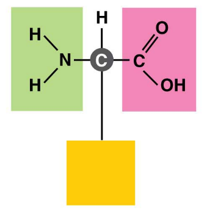

# Terminology
원어 | 번역
--- | ---
**Macromolecules** | 고분자
**Polymers** | 중합체
**monomers** | 단위체
**Carbohydrates** | 탄수화물
**Lipids** | 지질
**Nucleic acids** | 핵산
**sugar** | 당
**sucrose** | 설탕
**Monosaccharides** | 단당류
**Glucose** | 포도당
**Fructose** | 과당
**hydrophilic** | 친수성
**(un)saturated** | (불)포화
**Hydrogenation** | 수소화

---
# Organic compounds
carbon-based molcules

## Carbon chemistry
- carbon is a versatile molecule
    - carbon can share electrons with other atoms in four covalent bonds.
    - it is possible to construct an endless diversity of carbon skeletons  varying in size and branching pattern
- unique properties of organic compound depend on
    - its carbon skeleton and
    - the atoms attached to the skeleton
- the groups of atoms directly involved in chemical reactions are called **functional groups**

# Functional group

- Methyl group을 제외하고 Ionic unbalance 하다.
- Carbonyl group에 C=O 부분의 위치에 따라 Kethone(가운데), Aldehyde(끝)로 나뉨
- Carboxyl group은 유기산에 있어 필수 요소임
- Phosphate group은 강력하게 결합되어 ATP 생성, 큰 물질 결합 시 이용
---
# Large Biological Molecules
- There are four categories of large biological molecules found in all living creatures
    1. Carbohydrates
    2. Lipids
    3. Proteins
    4. nucleic acids
---
# Carbohydrates
- include sugars and polymers of sugar

## glycosid bond
1. α - 1,4 glycosid bond
2. β - 1,4 glycosid bond
3. branch
    - 6번 탄소 CH2OH에 1번 혹은 4번 OH기가 붙어 가지를 형성

## Monosaccharides

- In water, many monosaccharides form rings
    - it is stable form(less interaction)

- 1번 탄소의 OH기가 아래에 있으면 α-glucose, 위에 있으면 β-glocose
- 결합 시 α-glucose는 같은 방향을, β-glocose은 반대 방향을 향함

## Disaccharides
- two monosaccharides with glycosidic bond(linkage) by dehydration reaction.

disaccharides | mono1 | mono2 | bond
--- | --- | --- | ---
lactose | glucose | galactose | glycosidic bonds (1,4)
maltose | glucose | glucose | α-1,4 glycosidic bonds
sucrose | glucose | fructose | glycosidic bonds (1,4)

> High-fructose corn syrup(HFCS) : glucose in corn syrup to much sweeter fructose with isomerase

## Polysaccharides
- complex carbohydrates
- polymers of monossacharides
- stable -> good for saving energy
- empty space(twisted structure) make glycosidase decompose polysaccharides easily

### Starch
 - long string of glucose monomers.
 - used by plant cell to store energy
 - α- 1,4 glycosid bond -> spiral structure
 - some of it have branch. **some**
 
### Glycogen
- used by animal to store energy
- break down to release glucose
- α- 1,4 glycosid bond with branch by α- 1,6 glycosid bond (in many case...)

### Cellulose
- abundant organic compound on Earth
- cannot be broken by any enzyme produced by animals
- β - 1,4 glycosid bond

---

# Lipids
- hydrophobic
- diverse group of molecules made from **diffent molecular building blocks** that are unable to mix with water
- neither huge macromolecules nor necessarily polymers built from repeating monomers.

## Fats
- triglyceride
- consists of a glycerol molecule joined with three fatty acid molecules via dehydration reaction

- perform essential function in the human body
    - energy storage, cushioning and insulation
- If carbon skeleton of fatty acid has fewer thatn the maximum number of hydrogens at the **double bond**, it is **unsaturated**
    - by its double bond, its structure is fixed. so it has density and easy to be melted(good for Poikilotherm(변온동물) and plant)
- saturated fat has all three of its fatty acid saturated.
- Most animal fats
    - relatively high portion of saturated fatty acids
    - easily stack, tending to be solid at room temperature.
- **Hydrogenation**
    - adds hydrogen
    - converts unsaturated fats to saturated fats
    - makes liquid fats solid at room temperature.
    - creates **trans fats**. its fatty acid has double bond. -> unsaturated fat
    - 

### diglyceride
- two fatty acids
- 인지질은 glycerol에 P(인)이 붙어 있음

## Steroids
- The carbon skeleton has four fused rings
- Steroids vary in the functional groups attached to this set of rings, and these chemical variations their function.
- 
- **Cholesterol**
    - key component of cell membranes
    - the base steroid from which body produces other steroids such as estrogen and testosterone

---

# Protein
- polymers of amino acid monomers
- account for more than 50% of the dry weight of most cells
- instrumental in almost everything cells do
    - structural, storage, contractile, transport, enzymes

## Amino Acids : Monomers of Proteins
- central carbon atom bonded to four covalent partners
    - carboxyl group (-COOH)
    - amino group (-NH2)
    - hydrogen atom
    - side chain giving amino acid its special chemical properties (R기)
- 

### twenty-one amino acid

## Peptide bonds
- cells link amino acids together by dehydration reaction with enzyme's help, forming **peptide bonds** and creating long chains of amino acids called, **polypeptides**
- 
- peptide -> polypeptide
- polypeptide -> 변형과정으로 기능함 -> protein
- protein's structure
    1. 1차 구조
        - polypeptide 내에서 아미노산이 순서대로 배열된 상태
    2. 2차 구조
        - polypetide의 일부가 뒤틀린 구조
            - α-helix : peptide bond에서 N-H기와 C=O기 혹은 4 자리 이전에 위치한 아미노산의 R기와 수소 결합  발생해 나선 모양을 이루는 구조
            - β-strand : peptide bond에서 N-H기와 C=O기에서 수소 결합이 발생해 R기의 방향이 위, 아래를 반복하면서 이어짐
            - β-sheet : β-strand 구조가 여러 개 이어지면서 그 사이에서 최소 2~3개의 수소 결합을 형성해 병품 구조를 이룸
    3. 3차 구조
        - R기 간 상호작용으로 연결되어 형성되며 compact함.
    4. 4차 구조 : 2개 이상의 3차 구조 polypeptide가 이루는 구조. 각각의 polypeptide도 단백질임.

### degradation vs denaturation
- degradation 분해 : 1차 구조가 깨짐. 강한 에너지에 의한 것
- denaturation 변성 : 2,3,4차 구조가 변형됨. 구조를 형성하는 interaction이 약해서 일어남. 높은 온도, pH 변화 등에 의해서 일어남
    - ex) denaturaion of normal protein by prion protein

---

# Nucleic Acids
- store information
- provide the instruction for building protein
- two types
    1. DNA, deoxyribonucleic acid => stable. no functional group in ribose
    2. RNA, ribonucleic acid => unstable. hydroxyl(-OH) group connected to 2' Carbon in ribose
- polymers made from monomers called nucleotides
- 동식물의 가장 큰 기본 구성 물질. necleotide가 억 단위로 붙으니...

## structure of nucleotide
1. a five-carbon sugar
2. a phosphate group
3. a nitrogen-containg base
    - adenine
    - guanine
    - thymine or uracil
    - cytosine

## phosphodiester bond
- dehydration reaction
- covalent bond
- dotted line describe this bond in last picture.