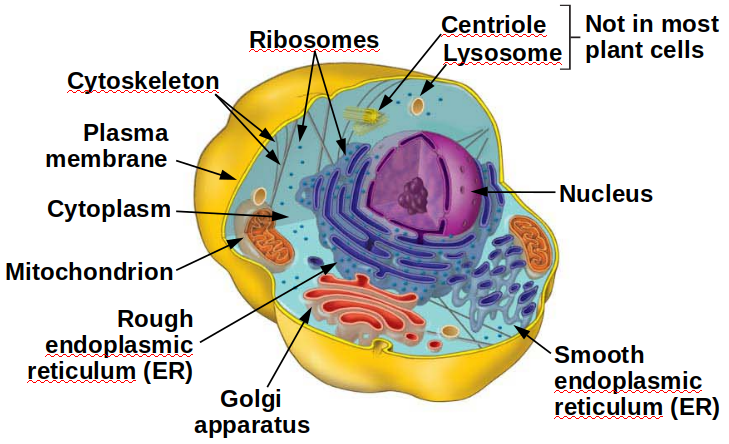

# Terminology

원어 | 번역
--- | ---
Plasma membrane | 원형질막
Nucleus | 핵
Chromatin | 풀린 염색체
Chromosome | 염색체 (단백질이 붙어 뭉친)
Envelope | 이중막
Nucleolus | 인
Nuclear pore | 핵공
Cytoplasm | 세포질
Cytosol | Cytoplasm의 액상 부분
Microtubles | 미세소관

---

# Cell theory
Cell theory state that all living things are composed of cells and that all cells come from eariler cells

### two basic categories
- Prokaryotic cells
    - Bacteria
    - Archaea
- Eukaryotic cells
    - Protists
    - Plants
    - Fungi
    - Animal

---

## Prokaryotic cell
- lacks a nucleus
- DNA is coiled into a nucleus-like region, necleoid
- necleoid is not partitioned from rest of cell

   

- ( capsule[optional] ( cell wall  ( plasma membrane ( internal part of cell
- cell wall
    - protect the cell
    - helps maintain its shape
- pili, which can attach to surface
- Flagella, whic propel them.

---

## Eukaryotic cells
Plant Cell | Animal Cell
--- | ---
 | 

### Organells
- Plasma membrane
    - Phospholipid bilayer
        - phospholipid is diglyceride, having
            - Hydrophilic head,
            - Hydrophobic tail
            - these part has similiar diameter, allowing forming layer
    - 아미노산 변이체, 탄수화물 변이체가 붙어 특정 기능 수행 가능(embedding)
        - ex) α-helix 구조를 가진 단백질의 내부가 친수성, 외부가 소수성으로 이루어져 plasma membrane에 박혀 친수성 물질 이동이 가능함
- Cell wall vs Extracelluar matrix
    - Plants
        - plans cells have a cell wall made from cellulose fiber
        - protect the cells
        - maintain cell shape
        - kepp cells from absorbing too much water
        - 구멍이 뚫려 있고 plasma membrane이 이를 통해 다른 세포의 plasma membrane과 연결하여 세포끼리의 연결이 이어짐
    - Anmials
        - Animal cells lack cell walls
        - Extracelluar matrix, fibers made of the protein collagen
            - 혈장 등 다양한 형태
        - hold cells together in **tissue**
        - the surfaces of animal cells contain cell junctions that connect each other into tissue, allowing the cells to **function in a coordinated way**
- Nucleus
    - Nuclear envelope에 쌓여 있다
        - Nuclear pore가 있으며 이는 단백질 망에 의해 통제되며 물질이 이동함
        - ER membrane과 연결되어 있다.
    -Nucleolus
        -리보솜이 생성됨
        -rRNA, 리보좀 생성에 필요한 기타 단백질이 뭉친 것
    -Ribosome
        - mRNA로 부터 단백질 생성.
        - 크고 작은 구성 단위로 이루어짐
        - 일부는 cytosol에서 대기하며, 나머지는 necleus나 ER에 붙어 단백질을 생성
- Endomembrane System : Manufacturing and Distributing Celluar Products
    - consists of
        - nuclear envelope
        - the endoplasmic reticulum (ER)
        - the Golgi apparatus
        - lysosomes, and
        - vacuoles
    - Endoplasmic Reticulum (ER)
        - its membrane is connected to nuclear envelope
        - ribosomes
        - Rough ER
            - 
        - Smooth ER
            - lacks surface ribosomes
            - produces lipids, including sterioids
            - helps liver cells detoxify circulating drugs
    - Golgi appratus
        - works in partnership with the ER
        - receives, refine, stores, and distributes chemical products of the cell
        - 
    - Lysosomes
        - membrane-enclosed sac of digestive enzymes.
        - break down large molcules such as proteins, polysaccharides, fats, and necleic acids.
        - and also damaged organells
        - 
    - Vacuoles
        - large sacs made of membrane that bud off from the ER or Golgi apparatus
        - have a variety of function, not only saving resources
- Chloroplasts and Mitochondria
    - Later...
- Cytoskeleton
    - network of fibers extending throughout the cytoplasm
    - skeleton and muscles for the cell. support and movement
    - Microtubles : Biggest diameter
        - tubes of protein, 2 types tubulin protein. spiral structure
        - ex) 방추사, 세포 골격 유지
    - Intermediate filaments
        - 다양한 구성 요소
        - 동물에만 있음
    - microfilaments : smallest diameter
        - actin protein
        - 세포 내 물질 이동, 세포 골격 유지